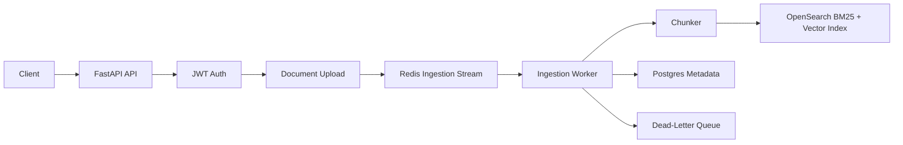
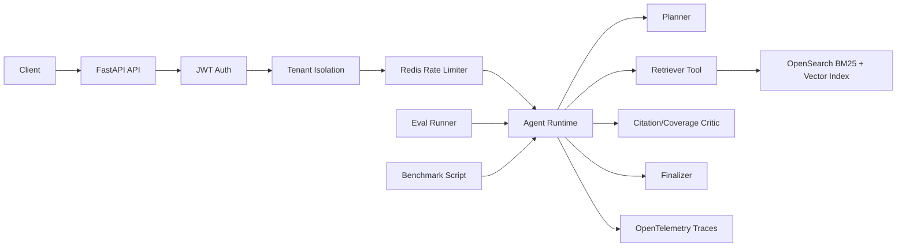

# AgentOps RAG

AgentOps RAG is a production-style reference implementation for agentic retrieval systems.

The project focuses on the operational contracts around RAG: tenant isolation, async ingestion, dead-letter queue recovery, citation-grounded answers, evals, traces, rate limits, benchmarks, and documented failure modes.

## What This Project Demonstrates

Most retrieval examples focus on the happy path: upload, embed, retrieve, answer. AgentOps RAG models the system behavior around that path:

- JWT-based tenant isolation at API and retrieval boundaries
- Async document ingestion with Redis Streams and DLQ replay
- Hybrid BM25/vector retrieval with score fusion
- Explicit planner, retriever, critic, and finalizer stages
- Citation-grounded answers and evidence-based refusals
- JSONL eval harness with generated reports
- OpenTelemetry spans across API, ingestion, retrieval, and agent workflows
- Redis Lua sliding-window rate limiting
- Benchmark reports and documented operational failure cases

## Design Goals

- Make unsupported answers fail visibly instead of returning confident but weakly grounded text.
- Keep tenant boundaries enforceable in API routes, retrieval, and admin replay flows.
- Treat ingestion as an async workflow with observable failure and replay semantics.
- Make evals, traces, and benchmarks part of the development loop.
- Keep agent orchestration explicit enough that the infrastructure decisions are easy to inspect.

## Non-goals

- This is not a polished chat UI.
- This is not a framework wrapper around LangChain or LangGraph.
- This is not a managed production deployment.
- This does not include a real tenant onboarding flow or hardened secrets management.

## Architecture

### Ingestion path



### Ask path



## Prerequisites

- Python 3.11+
- Docker and Docker Compose
- Make
- Git

## Quickstart

```bash
git clone https://github.com/shusingh/agentops-rag.git
cd agentops-rag
python -m venv .venv
source .venv/bin/activate
make setup
make docker-up
make seed
make test
make eval
make benchmark
make dev
```

On Windows PowerShell, activate the environment with:

```powershell
.\.venv\Scripts\Activate.ps1
```

Health check:

```bash
curl http://localhost:8000/health
```

Demo token:

```bash
curl -X POST http://localhost:8000/auth/demo-token \
  -H "Content-Type: application/json" \
  -d "{\"tenant_id\":\"demo\",\"subject\":\"demo-user\"}"
```

Example ask response shape:

```json
{
  "answer": "Based on the retrieved tenant documents: ...",
  "citations": [
    {
      "document_id": "doc_marketplace_policy",
      "chunk_id": "chunk_marketplace_policy",
      "title": "Marketplace Policy",
      "quote": "The marketplace policy requires sellers..."
    }
  ],
  "refused": false,
  "trace_id": "66875e46c211c9d53cde72b9675135ba",
  "retrieval": {
    "top_k": 5,
    "bm25_hits": 1,
    "vector_hits": 1
  }
}
```

## API Surface

```text
GET  /health
POST /auth/demo-token
GET  /auth/whoami
POST /documents
GET  /documents
POST /ask
GET  /admin/dlq
POST /admin/dlq/replay
POST /evals/run
```

## Agent Runtime

The runtime is explicit Python orchestration:

1. Planner returns a structured action: retrieve, refuse, or ask a clarifying question.
2. Retriever runs tenant-filtered hybrid retrieval.
3. Critic checks citation coverage and evidence support.
4. Finalizer returns either a citation-grounded answer or a refusal.

The code avoids hiding these steps behind a graph framework so the control flow, state boundaries, and failure behavior stay visible.

## Evaluation and Observability

Run evals with:

```bash
make eval
```

Reports are written to:

```text
evals/expected/latest_report.json
evals/expected/latest_report.md
```

Eval metrics include answer containment, citation precision, citation recall, refusal accuracy, unsupported claim rate, p50 latency, and p95 latency.

OpenTelemetry traces HTTP requests, auth validation, document upload, ingestion enqueue, ingestion jobs, chunking, OpenSearch indexing, DLQ writes and replays, retrieval, score fusion, model calls, critic decisions, and finalization.

Local traces are exported to the console by default:

```bash
TRACING_ENABLED=true
TRACING_CONSOLE_EXPORTER=true
make dev
```

Every `/ask` response includes a `trace_id`.

## Tenant Isolation

Tenant ID comes from JWT claims, not request bodies. Tests cover:

- tenant A cannot list tenant B documents
- tenant A cannot retrieve tenant B chunks
- tenant A cannot replay tenant B DLQ jobs
- request-body tenant IDs do not override JWT tenant IDs

## Ingestion and DLQ

Document ingestion is asynchronous by design:

1. API stores document metadata.
2. API enqueues an ingestion job.
3. Worker chunks and indexes content.
4. Worker marks the document indexed.
5. Failures are written to the DLQ with stage, retry count, tenant ID, and document ID.

This keeps ingestion failures observable and replayable instead of coupling every failure to the upload request.

## Rate Limiting

The rate limiter uses Redis and Lua sliding-window accounting. `/ask`, `/documents`, and `/evals/run` are limited by tenant ID and endpoint.

Redis unavailable behavior:

- `/ask` fails open with `X-RateLimit-Degraded: true`
- `/documents` fails closed with `503`
- `/evals/run` fails closed with `503`

## Benchmarks

Run:

```bash
make benchmark
```

Reports are written to:

```text
benchmark_reports/latest.json
benchmark_reports/latest.md
```

The benchmark measures throughput, p50 latency, p95 latency, failure rate, refusal count, and rate-limit block rate.

## Failure Cases

The `failure_cases/` directory documents operational failures:

- bad retrieval
- unsupported answer
- missing citation
- tenant isolation breach
- ingestion failure
- model timeout
- rate limit exceeded

Each case explains detection, trace/eval signals, local reproduction, and mitigation.

## Repository Structure

```text
app/
  agents/        planner, retriever, critic, and finalizer runtime
  api/           FastAPI routes
  auth/          JWT helpers and tenant claim handling
  db/            database setup and migrations
  evals/         eval scoring and report generation
  ingestion/     document ingestion and chunking
  rate_limit/    Redis Lua sliding-window limiter
  retrieval/     OpenSearch retrieval and score fusion
  telemetry/     OpenTelemetry setup
  tenants/       tenant isolation helpers
  workers/       async ingestion worker
evals/           JSONL datasets and expected reports
failure_cases/   documented operational failure scenarios
scripts/         seed, eval, and benchmark entry points
tests/           unit and integration tests
```

## Production Hardening Roadmap

- Replace local Postgres, Redis, and OpenSearch with managed services.
- Add migration tooling with Alembic.
- Add a real OpenAI-compatible model provider with timeouts and fallback.
- Add offline eval gates to CI.
- Add retrieval drift monitoring.
- Add worker autoscaling and poison-message thresholds.
- Export traces to OTLP/Jaeger instead of console.
- Harden secrets, tenant onboarding, and audit logs.
