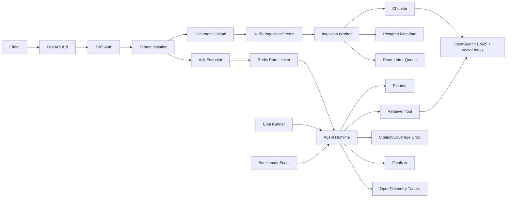

# AgentOps RAG

AgentOps RAG is a production-style agentic retrieval platform focused on the infrastructure around LLM agents: evals, traces, retries, dead-letter queues, tenant isolation, rate limits, failure recovery, benchmarks, and deployment discipline.

This is intentionally not a chatbot-first RAG demo. It is a systems project for showing how an AI application behaves when evidence is missing, answers are unsupported, ingestion fails, tenants must be isolated, and expensive endpoints need operational controls.

## Why This Is Not A RAG Demo

Most RAG demos stop at upload, embed, retrieve, answer. AgentOps RAG puts the production surface area first:

- JWT tenant isolation at API and retrieval boundaries
- async ingestion with Redis Streams and DLQ replay
- hybrid BM25/vector retrieval with score fusion
- explicit planner, retriever, critic, and finalizer stages
- citation-grounded answers and evidence-based refusals
- JSONL eval harness with reports
- OpenTelemetry spans for agent and ingestion workflows
- Redis Lua sliding-window rate limiting
- benchmark reports and documented failure modes

## Architecture



## Quickstart

```bash
git clone https://github.com/shusingh/agentops-rag.git
cd agentops-rag
python -m venv .venv
source .venv/bin/activate
make setup
make test
make eval
make benchmark
```

On Windows PowerShell, activate the environment with:

```powershell
.\.venv\Scripts\Activate.ps1
```

Start local dependencies when Docker is available:

```bash
make docker-up
make dev
```

Health check:

```bash
curl http://localhost:8000/health
```

Demo token:

```bash
curl -X POST http://localhost:8000/auth/demo-token \
  -H "Content-Type: application/json" \
  -d "{\"tenant_id\":\"demo\",\"subject\":\"demo-user\"}"
```

Example ask response shape:

```json
{
  "answer": "Based on the retrieved tenant documents: ...",
  "citations": [
    {
      "document_id": "doc_marketplace_policy",
      "chunk_id": "chunk_marketplace_policy",
      "title": "Marketplace Policy",
      "quote": "The marketplace policy requires sellers..."
    }
  ],
  "refused": false,
  "trace_id": "66875e46c211c9d53cde72b9675135ba",
  "retrieval": {
    "top_k": 5,
    "bm25_hits": 1,
    "vector_hits": 1
  }
}
```

## API Surface

```text
GET  /health
POST /auth/demo-token
GET  /auth/whoami
POST /documents
GET  /documents
POST /ask
GET  /admin/dlq
POST /admin/dlq/replay
POST /evals/run
```

## Agent Runtime

The runtime is explicit Python orchestration:

1. Planner returns structured action: retrieve, refuse, or ask a clarifying question.
2. Retriever runs tenant-filtered hybrid retrieval.
3. Critic checks citation coverage and evidence support.
4. Finalizer returns either a citation-grounded answer or refusal.

The code avoids LangChain/LangGraph so the infrastructure decisions are visible.

## Eval Harness

Run:

```bash
make eval
```

Reports are written to:

```text
evals/expected/latest_report.json
evals/expected/latest_report.md
```

Metrics include answer contains score, citation precision, citation recall, refusal accuracy, unsupported claim rate, p50 latency, and p95 latency.

## Tracing

OpenTelemetry traces HTTP requests, auth validation, document upload, ingestion enqueue, ingestion jobs, chunking, OpenSearch indexing, DLQ writes/replays, retrieval, score fusion, model calls, critic decisions, and finalization.

Local traces are exported to the console by default:

```bash
TRACING_ENABLED=true
TRACING_CONSOLE_EXPORTER=true
make dev
```

Every `/ask` response includes a `trace_id`.

## Tenant Isolation

Tenant ID comes from JWT claims, not request bodies. Tests prove:

- tenant A cannot list tenant B documents
- tenant A cannot retrieve tenant B chunks
- tenant A cannot replay tenant B DLQ jobs
- request-body tenant IDs do not override JWT tenant IDs

## Ingestion And DLQ

Document ingestion is asynchronous by design:

1. API stores document metadata.
2. API enqueues an ingestion job.
3. Worker chunks and indexes content.
4. Worker marks the document indexed.
5. Failures are written to the DLQ with stage, retry count, tenant ID, and document ID.

## Rate Limiting

The rate limiter uses Redis and Lua sliding-window accounting. `/ask`, `/documents`, and `/evals/run` are limited by tenant ID and endpoint.

Redis unavailable behavior:

- `/ask` fails open with `X-RateLimit-Degraded: true`
- `/documents` fails closed with `503`
- `/evals/run` fails closed with `503`

## Benchmarks

Run:

```bash
make benchmark
```

Reports are written to:

```text
benchmark_reports/latest.json
benchmark_reports/latest.md
```

The benchmark measures throughput, p50 latency, p95 latency, failure rate, refusal count, and rate-limit block rate.

## Failure Cases

The `failure_cases/` directory documents realistic operational failures:

- bad retrieval
- unsupported answer
- missing citation
- tenant isolation breach
- ingestion failure
- model timeout
- rate limit exceeded

Each case explains detection, trace/eval signals, local reproduction, and mitigation.

## What I Would Do Next In Production

- Replace local Postgres, Redis, and OpenSearch with managed services.
- Add migration tooling with Alembic.
- Add a real OpenAI-compatible model provider with timeouts and fallback.
- Add offline eval gates to CI.
- Add retrieval drift monitoring.
- Add worker autoscaling and poison-message thresholds.
- Export traces to OTLP/Jaeger instead of console.
- Harden secrets, tenant onboarding, and audit logs.
